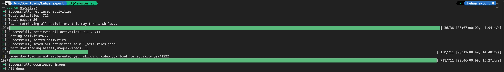

# KeHua Exporter

A eazy script to export **all** posts,notes,activities,images,videos from [KeHua (可话)](https://www.kehuaapp.com).

## Why export?

KeHua is a great app to record all of f**king life, it's free, simple, interesting, even no ads in the past years. But now, it's time to say goodbye :-(

They add a fucking **VIP** feature, and don't care new features from users want, just want to make money / no enough cash to maintain. Obviously, this is not the user's concern.

Well, I don't want to pay for it, and I don't want to lose my data. So I write this script to export all of my data.

## Statement

> [!WARNING]  
> **ONLY** for **PERSONAL** use, **DO NOT** use it for **COMMERCIAL** use, **DO NOT** break the law of the country where you live.

## Usage

1. capture the request headers from the KeHua app, and get the `Authorization` header.
```
GET /v1/api/[HIDDEN] HTTP/2
host: [HIDDEN]
accept: */*
content-type: application/json
accept-encoding: gzip, deflate, br
request-timestamp: 1731000000000
user-agent: ke hua/1.12.5 (iPhone; iOS 17.0.1; AppStore)
accept-language: zh-cn
authorization: Bearer [YOUR TOKEN]
```

2. set your TOKEN in your environment variables.
```bash
# Unix
export KEHUA_TOKEN="YOUR TOKEN"
# Windows
set KEHUA_TOKEN="YOUR TOKEN"
```

3. run the script
```bash
python export.py
```

4. wait for a while, all of your data will be saved in the `output` folder.



